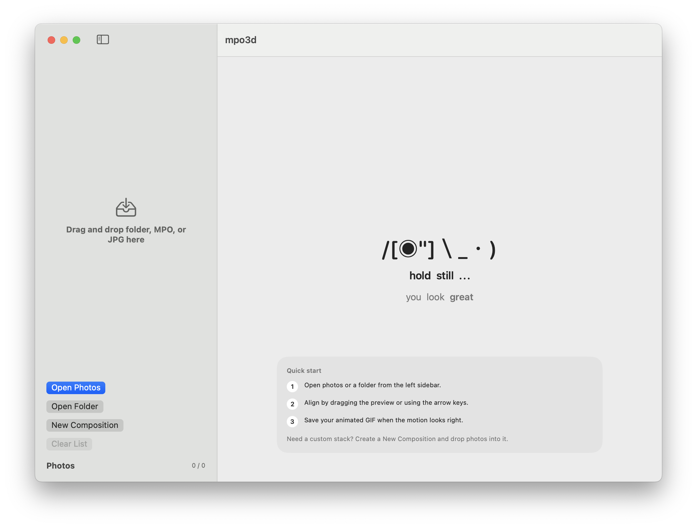
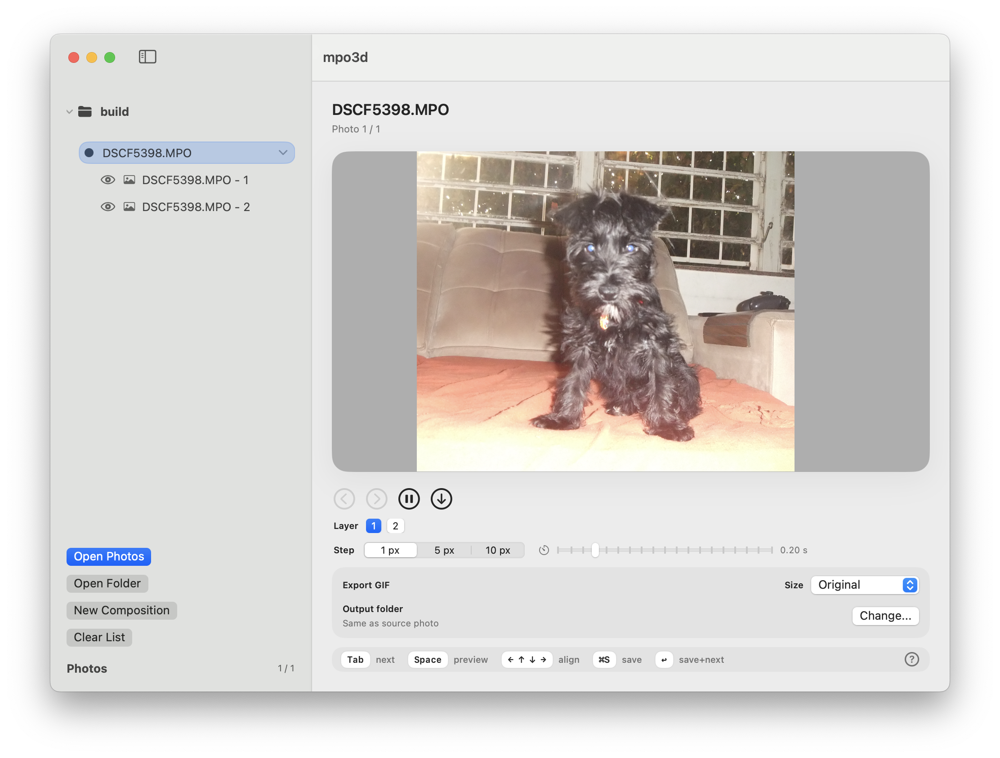

# mpo3d

**mpo3d** is a macOS app for converting stereo images into aligned animated GIFs.

It was created primarily for working with `.mpo` photos produced by 3D cameras, especially the Fuji FinePix Real 3D series. The app can also process layered or sequential `.jpg`, `.jpeg`, and `.png` images.

The project was built because I own a Fuji FinePix 3D camera and wanted a simpler, more reliable way to preview, align, and convert its MPO photos into animated GIFs.

## Supported formats

* `.mpo`
* `.jpg`
* `.jpeg`
* `.png`

While MPO is the main focus of the app, the other formats can be used to create animations from image pairs or multi-image stacks.

## Screenshots

## Highlights

- Open `.mpo`, `.jpg`, `.jpeg`, and `.png` files or full folders.
- Create custom compositions and reorder or merge layers with drag and drop.
- Manual alignment using mouse drag or keyboard arrows.
- Animated preview.
- Set velocity.
- Export to GIF.

## Usage

1. Click `Open Photos` to import specific files, or `Open Folder` to load a directory.
2. Use `New Composition` when you want to combine photos into a custom layered stack.
3. Reorder layers or compositions directly in the sidebar with drag and drop.
4. Adjust alignment by dragging in the preview or using the keyboard.
5. Preview motion, make adjustments, then export as GIF.

## Enjoy

- Feel free to message me about new features or to report any bugs.

## Requirements

- macOS 13 or later
